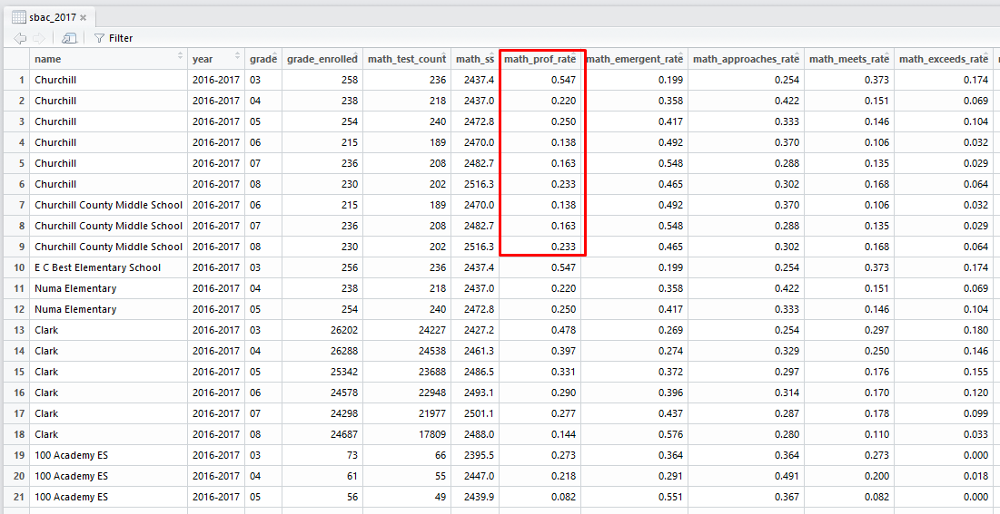

# nevadaReportCardr

Overview
--------
**nevadaReportCardr** is an open-source (GPL-3) R package that provides functions to connect to the publicly available API for [NevadaReportCard.com](http://nevadareportcard.com/DI/nv) (nrc). Additionally, this package contains already formatted data sets of most data available on Nevada Report Card (see below for more details).

This work was inspired by and adapted from the work that [James Estevez](https://github.com/jstvz) did for the [Downtown Achieves schools](https://github.com/jstvz/Downtown-Achieves-cflv).

You can learn more about the Nevada Report Card API at the [Nevada Report Card API site](http://www.nevadareportcard.com/DIWAPI-NVReportCard/Home/Explore).

All comments and ideas are welcome. Please submit any bugs to [Issues](https://github.com/DataInsightPartners/nevadaReportCardr/issues)

Installation
------------
```r

# To install development version
devtools::install_github('DataInsightPartners/nevadaReportCardr')

```


Available Data Sets
-------------

This package comes with most available data from Nevada Report Card already contained within the package. This data is available at the school, district, and state levels.  Here are the available data sets available once you install and load the package:

* `nrc_act` - ACT results from the 2015-2016 and 2016-2017 school years.
* `nrc_cohort_data` - Cohort graduation data for the classes of 2011 through 2016.
* `nrc_cte` - Career and Technical Education data for school years 2007-2008 through 2016-2017.
* `nrc_demographics` - Counts and rates of enrollment demographics for school years 2003-2004 through 2016-2017.
* `nrc_domains` - Information about the domains of data available throught the Nevada Report Card API.
* `nrc_fiscal` - Fiscal information for school years 2006-2007 through 2015-2016. This data is reported for the year prior. The data set contains both the accountability year and the report year.  The report year is the year for which the data is being reported.
* `nrc_orgs` - Contains the organization information for the organizations (schools, districts, state) contained within Nevada Report Card.
* `nrc_personnel` - Personnel data for the school years 2003-2004 through 2016-2017.
* `nrc_profiles` - Profile data for the organizations (schools, districts, state) for the school years 2006-2007 through 2016-2017.
* `nrc_sbac` - SBAC assessment data for school years 2015-2016 and 2016-2017 (those are the only two years for which data currently exists).
* `nrc_scopes` - Information about the scopes of data available in the Nevada Report Card API.
* `nrc_student` - Contains the data from the Student report on Nevada Report Card. Contains data such as Average Daily Attendance (ada), student teacher ratios, average class sizes, retention rates, credit deficiency, transciency rates, higher education remediation rates, and discipline data. This data set contains data for the school years 2003-2004 through 2016-2017.
* `nrc_technology` - Information regarding the counts of technology devices available to students for the school years 2011-2012 through 2016-2017.

#### Use Cases

Here is code to show how to access one of the data sets.
```r
# To install development version. You only need to install the package to your machine once.
devtools::install_github('DataInsightPartners/nevadaReportCardr')

# To load the package to your working environment.
#   You need to do this every time you launch a new session of R.
library(nevadaReportCardr)

# You can now view any of the data sets.
View(nrc_student)
View(nrc_sbac)
names(nrc_cohort_data)

# You can also assign the data to a global environment variable
#  so that you can aggregate, combine, or manipulate in some other way.
sbac_2017 <- nrc_sbac[nrc_sbac$year == '2016-2017', ]
View(sbac_2017)

```


Notice that the results have already been formatted to a decimal for ease of use.



Available Functions
-------------
Most of the functions available in this package won't need to be used because the data that they access from the Nevada Report Card API are already embedded in the package. However there are two useful functions that support work not easily available from the data sets:

 * `get_org_id` - Given a string of a partial or complete school or district name it will return the matching org_id (the unique id used by Nevada Report Card), the entity name, and the state_id.
 * `get_sbac_subgroup` - This function returns the SBAC assessment results of a given subgroup population based on the function parameters you provide.


#### Use Cases

```r
# To install development version. You only need to install the package to your machine once.
devtools::install_github('DataInsightPartners/nevadaReportCardr')

# To load the package to your working environment.
#   You need to do this every time you launch a new session of R.
library(nevadaReportCardr)

# View the help documentation.
?get_org_id
get_org_id('forbuss')
```


```r

# View the help documentation.
?get_sbac_subgroup

# Download the sbac results for male students at Forbuss ES.
#  The org_id for Forbuss was retreived in the last step with get_org_id('forbuss')
forbuss_male <- get_sbac_subgroup(org_ids = 64877, grades = 3:8, gender = 'M')

# Download the FRL SBAC results for all entities.
#   You can use the nrc_orgs data set to fetch all organiztion ids.
sbac_frl <- get_sbac_subgroup(org_ids = nrc_orgs$id, grades = 3:8, frl = 'Y')
View(sbac_frl)

```

Notice the data set returned by `get_sbac_subgroup` contains columns which indicate the filter and condition used to generate the data set.


#### Other Functions
To see the help documentation for any of these functions use the `?function_name` where "function_name" is replaced with the actual function name.
Here is an example:
```r

?get_act

```

Below is a short description of the available functions:

* `create_nrc_act` - This is the function that was used to create the nrc_act data set that comes with the nevadaReportCardr package. It adds state_id, org_id, and entity type to the ACT API data.
* `create_nrc_orgs` - This is the function that was used to create the nrc_orgs data set.
* `create_nrc_sbac` - This is the function that was used to create the nrc_sbac data set.  It adds state_id, org_id, and entity type to the SBAC API data.
* `get_act` - This function makes a call to the Nevada Report Card API to retrieve ACT results. Data that can be retrieved by this function is available in `nrc_act` which comes with the nevadaReportCardr package.
* `get_collection_id` - Nevada Report Card uses a collection id to get results for a set of organziations. This function gets that collection id given a set of organization ids.
* `get_cte` - This function makes a call to the Nevada Report Card API to retrieve CTE results. Data that can be retrieved by this function is available in `nrc_cte` which comes with the nevadaReportCardr package.
* `get_demographics` - This function makes a call to the Nevada Report Card API to retrieve demographic enrollment data. Data that can be retrieved by this function is available in `nrc_demographics` which comes with the nevadaReportCardr package.
* `get_fiscal` - This function makes a call to the Nevada Report Card API to retrieve fiscal data. Data that can be retrieved by this function is available in `nrc_fiscal` which comes with the nevadaReportCardr package.
* `get_grad_data` - This function makes a call to the Nevada Report Card API to retrieve graduation data. Data that can be retrieved by this function is available in `nrc_cohort_data` which comes with the nevadaReportCardr package.
* `get_org_id` - This function returns the Nevada Report Card organization id for an entity given a string containing part or all of that organziations name (school, district, or state).
* `get_personnel` - This function makes a call to the Nevada Report Card API to retrieve personnel data. Data that can be retrieved by this function is available in `nrc_personnel` which comes with the nevadaReportCardr package.
* `get_profile` - This function makes a call to the Nevada Report Card API to retrieve organization profile data. Data that can be retrieved by this function is available in `nrc_profiles` which comes with the nevadaReportCardr package.
* `get_sbac` - This function makes a call to the Nevada Report Card API to retrieve SBAC assessment data. Data that can be retrieved by this function is available in `nrc_sbac` which comes with the nevadaReportCardr package.
* `get_sbac_subgroup` - This function returns the SBAC assessment results of a given subgroup population based on the function parameters you provide.
* `get_student_data` - This function makes a call to the Nevada Report Card API to retrieve data from the student report. Data that can be retrieved by this function is available in `nrc_student` which comes with the nevadaReportCardr package.
* `get_technology` - This function makes a call to the Nevada Report Card API to retrieve data about technology available to students. Data that can be retrieved by this function is available in `nrc_technology` which comes with the nevadaReportCardr package.

